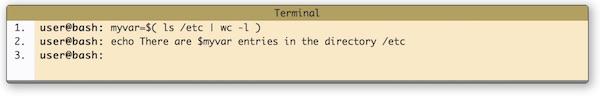

#Day 2 exercises
The program for today set up the linux server to use ssk-keys instead of passwords. And to get some bash-scripting done.

##Task 1
It is not common practice to log in as root. Instead, one use the command “sudo”. Sudo is a command, which allow a user to do things only root can normally do. However, a user need to be allowed to have this permission, and giving this permission can only be done by root. Log in as root, and give one of the user sudo rights. 

##Task 2
Secure all accounts on the linux machine using [step four to six](https://www.digitalocean.com/community/tutorials/initial-server-setup-with-ubuntu-14-04) of the [Initial Server Setup with Ubuntu 14.04](https://www.digitalocean.com/community/tutorials/initial-server-setup-with-ubuntu-14-04).

##Task 3 
Draw a sequence diagram showing what communication takes place between the local machine and the machine on digital ocean when establishing a ssh connection. The diagram can be on a slide or on paper – just something outside of your head.

Taking a look these might help:

* <https://www.digitalocean.com/community/tutorials/understanding-the-ssh-encryption-and-connection-process>
* <https://en.wikipedia.org/wiki/Public-key_cryptography>

#Bash scripting
These exercises are based on Ryans bash tutorial <http://ryanstutorials.net/bash-scripting-tutorial/>.

##Task 4 
Write a simple hello world bash script. 
Change it so that it instead of writing "Hello world" writes "Hello <user>" (where user is the name of the current user - which can be found as a variable in bash)
	
##Task 5
Try to explain to the person next to you what exactly this piece of bash does:

##Task 6
Create a script which will print a random word. There is a file containing a list of words on your system (usually /usr/share/dict/words or /usr/dict/words). Hint: Piping will be useful here. 
This exercise is taken from the bottom of this page <http://ryanstutorials.net/bash-scripting-tutorial/bash-variables.php>.

##Task 7
Create a script which will take data from STDIN and print the 3rd line only.
This exercise is taken from the bottom of this page <http://ryanstutorials.net/bash-scripting-tutorial/bash-input.php>.

##Task 8
Exercises from the bottom of <http://ryanstutorials.net/bash-scripting-tutorial/bash-if-statements.php>
Now let's make some decisions.

* Create a Bash script which will take 2 numbers as command line arguments. It will print to the screen the larger of the two numbers.
* Create a Bash script which will accept a file as a command line argument and analyse it in certain ways. eg. you could check if the file is executable or writable. You should print a certain message if true and another if false.
* Create a Bash script which will print a message based upon which day of the week it is (eg. 'Happy hump day' for Wedensday, 'TGIF' for Friday etc).

##Task 9
Create a bash script which will automate setting up the users in your group, installing their ssh keys, and adding them to the sudo group. This will make it easier to delete a droplet and start from fresh.